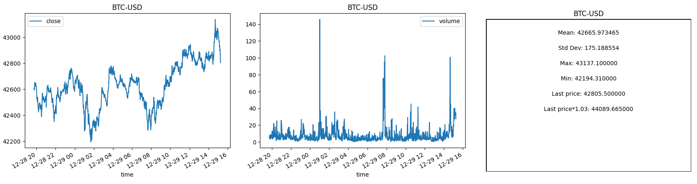

# crypto-dashboard
This repo is a simple crytpocurrency dashboard that shows basic information for 30 popular coins.

The basic features for this repo allow users to easily retrieve live price and volume data and plot them.

For each asset, it displays the following info:
- minute by minute price data over the past week
- minute by minute volume data over the past week
- min price over last week
- max price over last week
- mean price over last week
- standard deviation over last week
- current price
- current price * 3%

Below is an example of what one row looks like:
<div style="overflow: auto;">
    </h1>
</div>

# Usage
Once cloned and all requirements have been installed, cd to this repo and run
```
python3 app.py
```

*Note: It may take a while to update all of the prices, depending on how lond it has been since they last updated.
